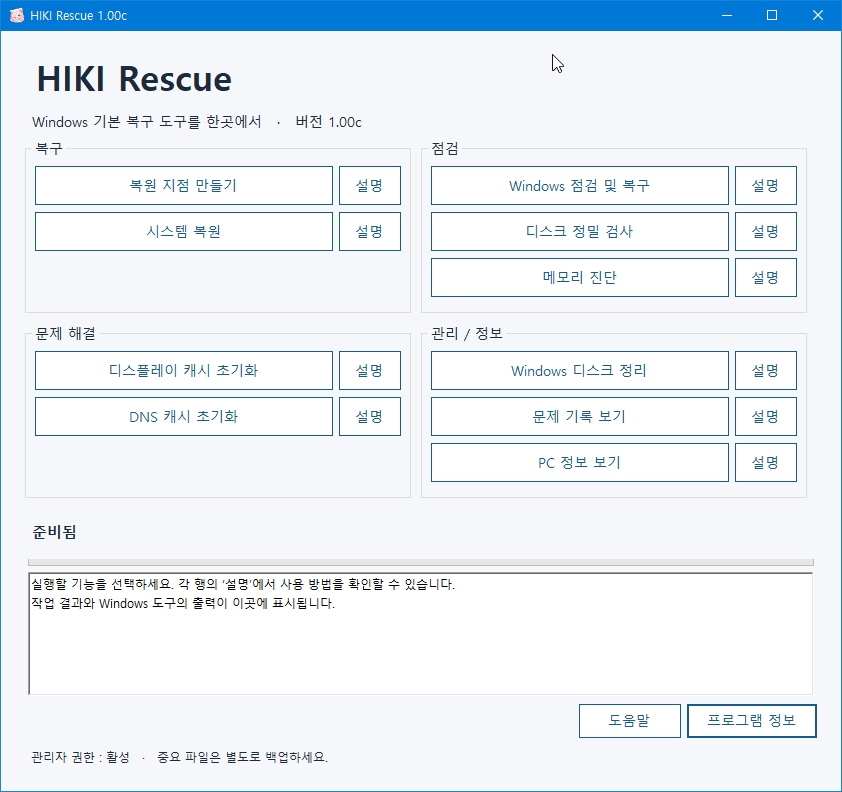

# HIKI Rescue

**HIKI Rescue**는 Eltax가 처음 Hikimori Neko를 위해 제작한  
**Windows 복구 및 점검 보조 유틸리티**입니다.

Windows에 기본 포함된 복원, 시스템 검사, 디스크 검사, 메모리 진단 및 문제 해결 기능을  
한 화면에서 보다 간단하게 사용할 수 있도록 구성했습니다.

현재는 일반 사용자도 사용할 수 있도록 공개 배포되고 있습니다.

## 주요 기능

### 복구

- **복원 지점 만들기**
  - Windows 시스템 복원 지점을 생성합니다.
  - 복구 작업 전 현재 시스템 상태를 저장할 때 사용할 수 있습니다.

- **시스템 복원**
  - Windows 기본 시스템 복원 도구를 실행합니다.
  - 저장된 복원 지점을 선택하여 이전 상태로 되돌릴 수 있습니다.

### 점검

- **Windows 점검 및 복구**
  - DISM과 SFC를 순서대로 실행하여 Windows 시스템 파일을 점검하고 복구합니다.

- **디스크 정밀 검사**
  - 시스템 드라이브에 CHKDSK 정밀 검사를 예약합니다.
  - 실제 검사는 Windows 재부팅 후 시작됩니다.

- **메모리 진단**
  - Windows 메모리 진단 도구를 실행합니다.
  - RAM 이상 여부를 확인할 때 사용할 수 있습니다.

### 문제 해결

- **디스플레이 캐시 초기화**
  - Windows의 디스플레이 구성 캐시를 백업한 뒤 초기화합니다.
  - 모니터 인식, 화면 배치, 해상도, 배율 및 다중 모니터 관련 문제가 발생했을 때 사용할 수 있습니다.

- **DNS 캐시 초기화**
  - Windows DNS 캐시를 초기화합니다.
  - DNS 관련 접속 문제를 해결할 때 사용할 수 있습니다.

### 관리 / 정보

- **Windows 디스크 정리**
  - Windows 기본 디스크 정리 도구를 실행합니다.

- **문제 기록 보기**
  - Windows 신뢰성 모니터를 실행하여 프로그램 오류, 시스템 오류 및 비정상 종료 기록을 확인할 수 있습니다.

- **PC 정보 보기**
  - Windows 시스템 정보 도구를 실행하여 CPU, 메인보드, BIOS, Windows 버전 등의 정보를 확인할 수 있습니다.

## 지원 환경

- Windows 10 x64
- Windows 11 x64
- .NET Framework 4.8
- 일부 기능은 관리자 권한이 필요합니다.

## 특징

HIKI Rescue는 별도의 복구 엔진을 설치하는 프로그램이 아닙니다.

가능한 범위에서 Windows에 기본 포함된 기능과 공식 Windows API를 이용하며,  
불필요한 상주 서비스, 자동 실행, 원격 제어, 광고, 텔레메트리, 다운로드 기능 등을 사용하지 않습니다.

프로그램은 기본적으로 로컬 환경에서 동작합니다.

## 사용 전 주의사항

시스템 복원, 디스크 검사, 레지스트리 관련 복구 기능은 Windows 설정에 영향을 줄 수 있습니다.

중요한 파일은 별도로 백업한 뒤 사용하는 것을 권장합니다.

특히 **디스플레이 캐시 초기화**를 실행하면  
모니터 배치, 해상도, 배율 등의 설정이 Windows에서 다시 감지될 수 있습니다.

## 다운로드

최신 배포 버전은 GitHub의 **Releases**에서 받을 수 있습니다.

- Repository: https://github.com/laikal/HIKI-Rescue/
- Releases: https://github.com/laikal/HIKI-Rescue/releases

## 지원 / 문의

- Support Email: **eltax.support@gmail.com**
- Issues: https://github.com/laikal/HIKI-Rescue/issues
- Privacy Policy: https://github.com/laikal/HIKI-Rescue/blob/main/PRIVACY.md

## 프로그램 정보

- **Program:** HIKI Rescue
- **Version:** 1.00c
- **Developer:** Eltax
- **Originally created for:** Hikimori Neko
- **Framework:** .NET Framework 4.8

---

Copyright © 2026 Eltax
