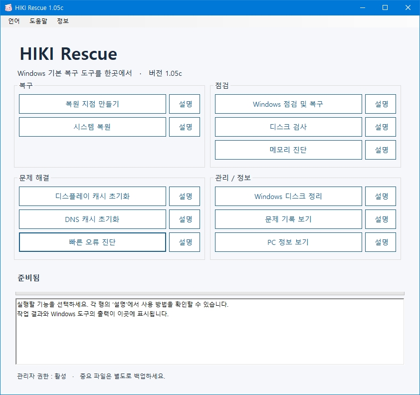
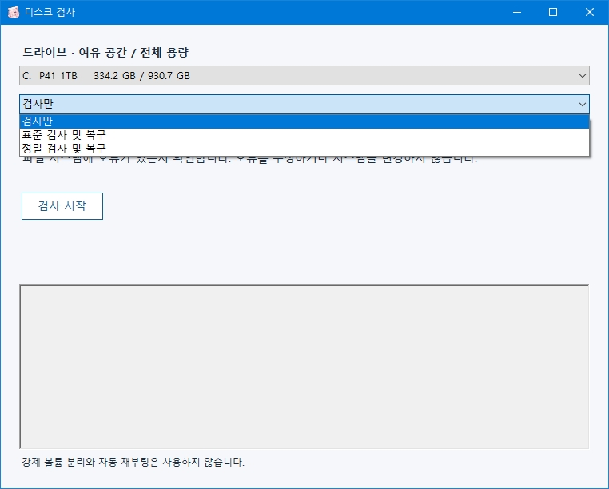
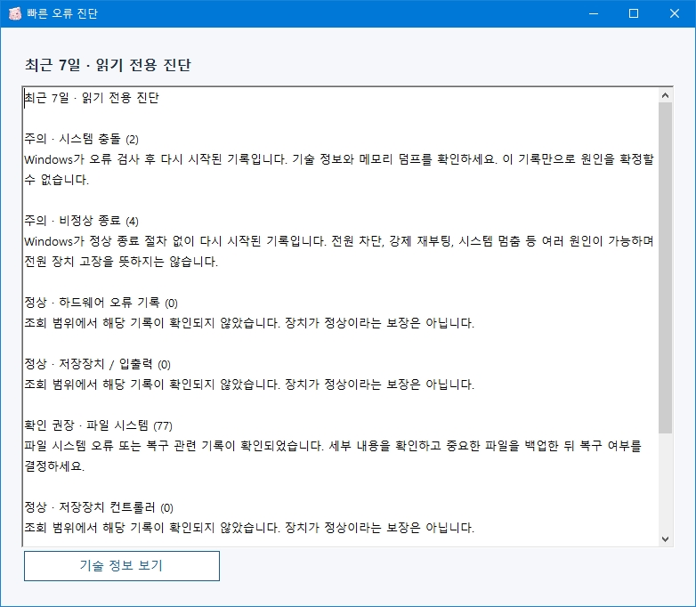

# HIKI Rescue

**English | [한국어](#한국어)**

**HIKI Rescue** is a Windows recovery and diagnostic utility originally created by Eltax for Hikimori Neko.

It provides a simpler and easier-to-understand interface for recovery, system integrity checks, disk diagnostics, memory diagnostics, and troubleshooting tools already included with Windows.

HIKI Rescue is now publicly available for general users.



## Features

### Recovery

- **Create Restore Point**
  - Creates a Windows System Restore point.
  - Useful for saving the current system state before performing recovery operations.
  - Restore point creation and result validation have been improved for better reliability.

- **System Restore**
  - Opens the built-in Windows System Restore tool.
  - Allows you to restore Windows to a previously saved restore point.

### Diagnostics

- **Windows Check and Repair**
  - Runs DISM followed by SFC to check and repair Windows system files.
  - Process results and exit status are checked before the operation is reported as complete.

- **Disk Check**
  - Allows you to select the local drive you want to check.
  - CHKDSK command-line options are presented as three user-friendly modes.

  **Check Only**
  - Checks the file system for errors without modifying the drive.

  **Standard Check and Repair**
  - Checks the file system and repairs detected file system errors.

  **Thorough Check and Repair**
  - Performs a more extensive scan for file system errors and bad sectors and attempts to recover readable data.
  - This operation may take a long time depending on the size and speed of the drive.

  If a drive is currently in use by Windows, HIKI Rescue can offer to schedule the check for the next reboot when required.

  HIKI Rescue does not forcibly dismount volumes during disk checks.



- **Memory Diagnostic**
  - Opens the Windows Memory Diagnostic tool.
  - Can be used to check for possible RAM problems.

### Troubleshooting

- **Reset Display Cache**
  - Backs up and resets Windows display configuration cache data.
  - Can help with monitor detection, display layout, resolution, scaling, and multi-monitor related issues.
  - GPU drivers themselves are not removed or modified.

- **Flush DNS Cache**
  - Clears the Windows DNS resolver cache.
  - Can help resolve DNS-related connection problems.

- **Quick Error Diagnostics**
  - Reads important Windows system events from the last 7 days in read-only mode.
  - Converts selected Event Viewer records into descriptions that are easier for general users to understand.
  - Can identify records related to unexpected shutdowns, BSODs, WHEA hardware errors, storage issues, file system errors, and selected display driver errors.
  - Technical information such as Provider, Event ID, occurrence time, and event details can also be viewed when needed.

  Quick Error Diagnostics does not delete Event Logs or automatically modify system settings.

  It does not determine that a specific CPU, GPU, power supply, storage device, or other component has failed based only on a single event.



### Management / Information

- **Windows Disk Cleanup**
  - Opens the built-in Windows Disk Cleanup tool.

- **View Problem History**
  - Opens Windows Reliability Monitor to review application failures, system errors, and unexpected shutdowns.

- **View PC Information**
  - Opens Windows System Information to view information such as CPU, motherboard, BIOS, and Windows version.

## Multi-language Support

Starting with HIKI Rescue 1.05c, the application supports external INI-based language packs.

Languages included by default:

- Korean
- English

The active language can be changed from the **Language** menu at the top of the application.

The selected language is remembered for future launches.

Language files are stored in the `LANG` directory.

```text
HIKI Rescue\
├─ HIKI Rescue.exe
└─ LANG\
   ├─ ko.ini
   └─ en.ini
```

The supported language list is not hard-coded into the application.

Users can create additional language files using the HIKI Rescue INI language format and place them inside the `LANG` directory.

Example:

```ini
[Language]
Name=日本語
Code=ja
```

Valid language files are automatically detected when HIKI Rescue starts and are added to the Language menu.

This allows users and the community to add additional translations without modifying or recompiling the application.

If an additional language file is missing some translated entries, HIKI Rescue falls back to the default Korean strings for those entries.

## System Requirements

- Windows 10 x64
- Windows 11 x64
- .NET Framework 4.8
- Some operations require administrator privileges.

## Design

HIKI Rescue does not install a separate recovery engine.

Whenever possible, it uses recovery and diagnostic tools already included with Windows together with official Windows APIs.

HIKI Rescue does not use unnecessary background services, automatic startup components, remote control, advertisements, telemetry, or automatic download functionality.

The application operates primarily on the local computer.

Quick Error Diagnostics is also read-only and does not modify Event Logs or system settings automatically.

## Important Notes

System Restore, disk repair, and registry-related recovery operations can modify Windows system settings.

Backing up important files before performing recovery operations is recommended.

Using **Reset Display Cache** may cause Windows to detect your monitor layout, resolution, scaling, and related display settings again.

**Standard Check and Repair** and **Thorough Check and Repair** may modify the file system.

For a system drive currently in use, Windows may perform the requested disk check during the next reboot.

## Download

The latest public version is available from GitHub **Releases**.

- Repository: https://github.com/laikal/HIKI-Rescue/
- Releases: https://github.com/laikal/HIKI-Rescue/releases

The Portable package includes the default Korean and English language files.

## Support

- Support Email: **eltax.support@gmail.com**
- Issues: https://github.com/laikal/HIKI-Rescue/issues
- Privacy Policy: https://github.com/laikal/HIKI-Rescue/blob/main/PRIVACY.md

## Program Information

- **Program:** HIKI Rescue
- **Version:** 1.05c
- **Developer:** Eltax
- **Originally created for:** Hikimori Neko
- **Framework:** .NET Framework 4.8
- **Default Languages:** Korean / English
- **Additional Languages:** User-created INI language packs supported

---

# 한국어

**[English](#hiki-rescue) | 한국어**

**HIKI Rescue**는 Eltax가 처음 Hikimori Neko를 위해 제작한  
**Windows 복구 및 점검 보조 유틸리티**입니다.

Windows에 기본 포함된 복원, 시스템 검사, 디스크 검사, 메모리 진단 및 문제 해결 기능을  
한 화면에서 보다 간단하고 이해하기 쉽게 사용할 수 있도록 구성했습니다.

현재는 일반 사용자도 사용할 수 있도록 공개 배포되고 있습니다.


## 주요 기능

### 복구

- **복원 지점 만들기**
  - Windows 시스템 복원 지점을 생성합니다.
  - 복구 작업 전 현재 시스템 상태를 저장할 때 사용할 수 있습니다.
  - 복원 지점 생성 결과를 보다 엄격하게 확인하도록 안정성이 개선되었습니다.

- **시스템 복원**
  - Windows 기본 시스템 복원 도구를 실행합니다.
  - 저장된 복원 지점을 선택하여 이전 상태로 되돌릴 수 있습니다.

### 점검

- **Windows 점검 및 복구**
  - DISM과 SFC를 순서대로 실행하여 Windows 시스템 파일을 점검하고 복구합니다.
  - 실행 결과와 종료 상태를 확인하여 작업 결과를 표시합니다.

- **디스크 검사**
  - 검사할 로컬 드라이브를 직접 선택할 수 있습니다.
  - CHKDSK의 명령줄 옵션을 직접 입력할 필요 없이 세 가지 검사 방식을 선택할 수 있습니다.

  **검사만**
  - 파일 시스템에 오류가 있는지 확인합니다.
  - 오류를 수정하거나 시스템을 변경하지 않습니다.

  **표준 검사 및 복구**
  - 파일 시스템 오류를 검사하고 발견된 오류를 수정합니다.

  **정밀 검사 및 복구**
  - 파일 시스템 오류와 불량 섹터를 정밀하게 검사하고 읽을 수 있는 데이터를 복구합니다.
  - 드라이브의 용량과 속도에 따라 시간이 오래 걸릴 수 있습니다.

  Windows에서 현재 사용 중인 드라이브는 필요한 경우 다음 재부팅 시 검사를 예약할 수 있습니다.

  HIKI Rescue는 디스크 검사 과정에서 볼륨을 강제로 분리하지 않습니다.


- **메모리 진단**
  - Windows 메모리 진단 도구를 실행합니다.
  - RAM 이상 여부를 확인할 때 사용할 수 있습니다.

### 문제 해결

- **디스플레이 캐시 초기화**
  - Windows의 디스플레이 구성 캐시를 백업한 뒤 초기화합니다.
  - 모니터 인식, 화면 배치, 해상도, 배율 및 다중 모니터 관련 문제가 발생했을 때 사용할 수 있습니다.
  - GPU 드라이버 자체는 삭제하거나 수정하지 않습니다.

- **DNS 캐시 초기화**
  - Windows DNS 캐시를 초기화합니다.
  - DNS 관련 접속 문제를 해결할 때 사용할 수 있습니다.

- **빠른 오류 진단**
  - 최근 7일 동안 Windows에 기록된 주요 시스템 오류를 읽기 전용으로 확인합니다.
  - Event Viewer의 복잡한 항목을 일반 사용자가 이해하기 쉬운 표현으로 요약합니다.
  - 비정상 종료, BSOD, WHEA 하드웨어 오류, 저장장치, 파일 시스템 및 일부 디스플레이 드라이버 관련 오류를 확인할 수 있습니다.
  - 필요한 경우 Provider, Event ID, 발생 시각 및 이벤트 상세 정보 등의 기술 정보를 별도로 확인할 수 있습니다.

  빠른 오류 진단은 이벤트 기록을 삭제하거나 시스템 설정을 변경하지 않습니다.

  또한 특정 이벤트 하나만으로 CPU, GPU, 파워서플라이, 저장장치 등의 고장을 단정하지 않습니다.


### 관리 / 정보

- **Windows 디스크 정리**
  - Windows 기본 디스크 정리 도구를 실행합니다.

- **문제 기록 보기**
  - Windows 신뢰성 모니터를 실행하여 프로그램 오류, 시스템 오류 및 비정상 종료 기록을 확인할 수 있습니다.

- **PC 정보 보기**
  - Windows 시스템 정보 도구를 실행하여 CPU, 메인보드, BIOS, Windows 버전 등의 정보를 확인할 수 있습니다.

## 다국어 지원

HIKI Rescue 1.05c부터 외부 INI 기반 언어팩을 지원합니다.

기본 제공 언어:

- 한국어
- English

프로그램 상단의 **언어** 메뉴에서 사용할 언어를 선택할 수 있으며,  
선택한 언어는 다음 실행에서도 유지됩니다.

언어 파일은 프로그램의 `LANG` 폴더에 저장됩니다.

```text
HIKI Rescue\
├─ HIKI Rescue.exe
└─ LANG\
   ├─ ko.ini
   └─ en.ini
```

지원 언어 목록은 프로그램에 고정되어 있지 않습니다.

사용자가 HIKI Rescue의 언어 파일 형식에 맞는 새로운 INI 파일을 `LANG` 폴더에 추가하면  
프로그램 시작 시 자동으로 인식하여 언어 메뉴에 추가합니다.

예:

```ini
[Language]
Name=日本語
Code=ja
```

따라서 별도의 프로그램 수정이나 재컴파일 없이  
사용자 또는 커뮤니티가 만든 추가 언어팩을 사용할 수 있습니다.

추가 언어팩에 일부 번역 항목이 없을 경우  
해당 항목은 기본 한국어 문자열을 사용합니다.

## 지원 환경

- Windows 10 x64
- Windows 11 x64
- .NET Framework 4.8
- 일부 기능은 관리자 권한이 필요합니다.

## 특징

HIKI Rescue는 별도의 복구 엔진을 설치하는 프로그램이 아닙니다.

가능한 범위에서 Windows에 기본 포함된 기능과 공식 Windows API를 이용하며,  
불필요한 상주 서비스, 자동 실행, 원격 제어, 광고, 텔레메트리, 자동 다운로드 기능 등을 사용하지 않습니다.

프로그램은 기본적으로 로컬 환경에서 동작합니다.

빠른 오류 진단 역시 Windows Event Log를 읽기만 하며  
이벤트 기록이나 시스템 설정을 자동으로 수정하지 않습니다.

## 사용 전 주의사항

시스템 복원, 디스크 검사, 레지스트리 관련 복구 기능은 Windows 설정에 영향을 줄 수 있습니다.

중요한 파일은 별도로 백업한 뒤 사용하는 것을 권장합니다.

특히 **디스플레이 캐시 초기화**를 실행하면  
모니터 배치, 해상도, 배율 등의 설정이 Windows에서 다시 감지될 수 있습니다.

**표준 검사 및 복구** 또는 **정밀 검사 및 복구**는 파일 시스템을 수정할 수 있으며,  
현재 사용 중인 시스템 드라이브는 다음 재부팅 시 검사가 진행될 수 있습니다.

## 다운로드

최신 배포 버전은 GitHub의 **Releases**에서 받을 수 있습니다.

- Repository: https://github.com/laikal/HIKI-Rescue/
- Releases: https://github.com/laikal/HIKI-Rescue/releases

Portable 배포판에는 기본 한국어/영어 LANG 파일이 함께 포함됩니다.

## 지원 / 문의

- Support Email: **eltax.support@gmail.com**
- Issues: https://github.com/laikal/HIKI-Rescue/issues
- Privacy Policy: https://github.com/laikal/HIKI-Rescue/blob/main/PRIVACY.md

## 프로그램 정보

- **Program:** HIKI Rescue
- **Version:** 1.05c
- **Developer:** Eltax
- **Originally created for:** Hikimori Neko
- **Framework:** .NET Framework 4.8
- **기본 제공 언어:** 한국어 / English
- **추가 언어:** 사용자 제작 INI 언어팩 지원

---

Copyright © 2026 Eltax
